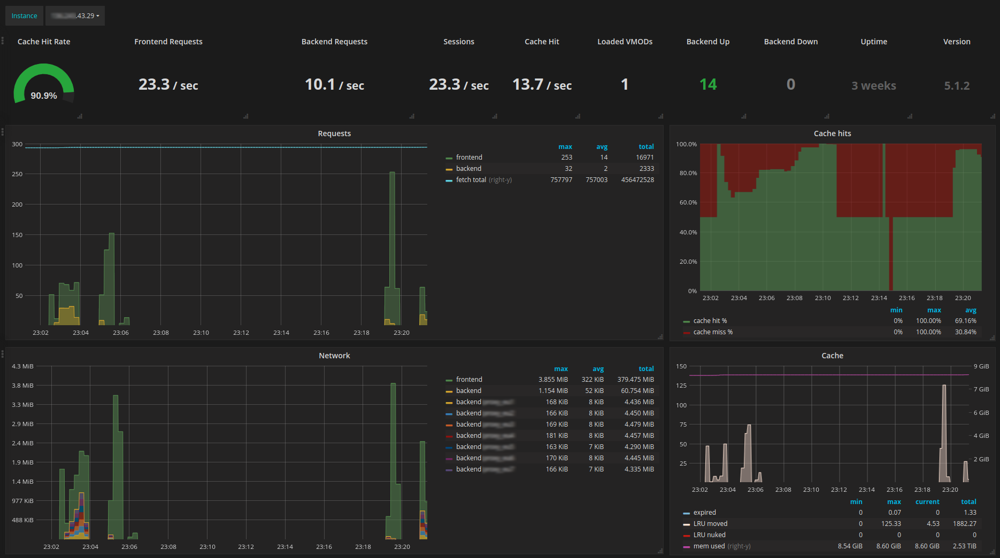

[](https://travis-ci.org/jonnenauha/prometheus_varnish_exporter)

# Varnish exporter for Prometheus



Scrapes the `varnishstat -j` JSON output on each Prometheus collect and exposes all reported metrics. Metrics with multiple backends or varnish defined identifiers (e.g. `VBE.*.happy SMA.*.c_bytes LCK.*.creat`) and other metrics with similar structure (e.g. `MAIN.fetch_*`) are combined under a single metric name with distinguishable labels. Vanish naming conventions are preserved as much as possible to be familiar to Varnish users when building queries, while at the same time trying to following Prometheus conventions like lower casing and using `_` separators.

Handles runtime Varnish changes like adding new backends via vlc reload. Removed backends are reported by `varnishstat` until Varnish is restarted.

Advanced users can use `-n -N`, they are passed to `varnishstat`.

I have personally tested the following versions of Varnish to work `6.0.0, 5.2.1, 5.1.2, 4.1.1, 4.1.0, 4.0.3 and 3.0.5`. Missing category groupings in 3.x like `MAIN.` are detected and added automatically for label names to be consistent across versions, assuming of course that the Varnish project does not remove/change the stats.

I won't make any backwards compatibility promises at this point. Your built queries can break on new versions if metric names or labels are refined. If you find bugs or have feature requests feel free to create issues or send PRs.

# Installing and running

You can find the latest binary releases for linux, darwin, windows, freebsd, openbsd and netbsd  from the [github releases page](https://github.com/jonnenauha/prometheus_varnish_exporter/releases).

By default the exporter listens on port 9131. See `prometheus_varnish_exporter -h` for available options. It is recommended to use `-no-exit` in production to not exit the process on failed scrapes. Note that if Varnish is not running, `varnishstat` will still produce a successful scrape.

To test that `varnishstat` is found on the host machine and to preview all exported metrics run

    prometheus_varnish_exporter -test

# Docker

Scraping metrics from Varnish running in a docker container is possible since 1.4.1. I still don't have a easy, clear and user friendly way of running this exporter in a docker container, if you have any ideas open a issue. Resolve your Varnish container name with `docker ps` and run the following. This will use `docker exec <container-name>` to execute varnishstat inside the spesified container.

    prometheus_varnish_exporter -no-exit -docker-container-name <container_name>

# Grafana dashboards

You can download my dashboard seen in the above picture [here](dashboards/jonnenauha/dashboard.json). I use it at work with our production Varnish instances. I would be interested in your dashboards if you wish to share them or improvement ideas to my current one.

# Varnish 4 and VCL UUIDs

Starting with version 1.2 `backend` and `server` labels are always set. For backend-related metrics and Varnish 4 the `server` tag will be set to the VCL UUIDs for that backend. Note that there might be multiple VCLs loaded at the same time and the `server` tag might not be meaningful in that case.

To aggregate all loaded VCLs into per-backend metric the following Prometheus [recording rules](https://prometheus.io/docs/querying/rules/) are recommended:

    backend:varnish_backend_bereq_bodybytes:sum = sum(varnish_backend_bereq_bodybytes) without (server)
    backend:varnish_backend_bereq_hdrbytes:sum = sum(varnish_backend_bereq_hdrbytes) without (server)
    backend:varnish_backend_beresp_bodybytes:sum = sum(varnish_backend_beresp_bodybytes) without (server)
    backend:varnish_backend_beresp_hdrbytes:sum = sum(varnish_backend_beresp_hdrbytes) without (server)
    backend:varnish_backend_conn:sum = sum(varnish_backend_conn) without (server)
    backend:varnish_backend_happy:sum = sum(varnish_backend_happy) without (server)
    backend:varnish_backend_pipe_hdrbytes:sum = sum(varnish_backend_pipe) without (server)
    backend:varnish_backend_pipe_in:sum = sum(varnish_backend_pipe_in) without (server)
    backend:varnish_backend_pipe_out:sum = sum(varnish_backend_pipe_out) without (server)
    backend:varnish_backend_req:sum = sum(varnish_backend_req) without (server)

# Build

**One time setup**
1. [Install go](https://golang.org/doc/install) or use OS repos `golang` package.
2. Make a directory e.g. `~/go-workspace` for go development and set it to env variable `GOPATH`.

**Development**
```bash
# clone
mkdir -p $GOPATH/src/github.com/jonnenauha
cd $GOPATH/src/github.com/jonnenauha
git clone git@github.com:jonnenauha/prometheus_varnish_exporter.git
cd prometheus_varnish_exporter

# build
go get -v   # get deps
go build    # build binary to current directory

# release with cross compilation
./build.sh <version>
```

You can fork this repo and replace the working dir with `$GOPATH/src/github.com/<username>` and sent PRs from your development fork. Other git providers than github will also work just fine, just adapt your package dir path.
