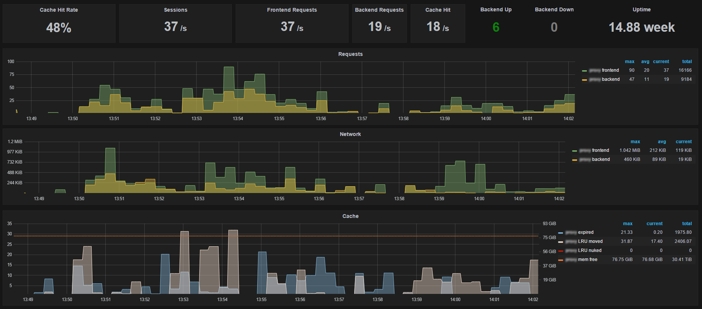

# Varnish exporter for Prometheus
[][circleci]

Scrapes the `varnishstat -j` JSON output on each Prometheus collect and exposes all reported metrics. Metrics with multiple backends or varnish defined identifiers (e.g. `VBE.*.happy SMA.*.c_bytes LCK.*.creat`) and other metrics with similar structure (e.g. `MAIN.fetch_*`) are combined under a single metric name with distinguishable labels. Vanish naming conventions are preserved as much as possible to be familiar to Varnish users when building queries, while at the same time trying to following Prometheus conventions like lower casing and using `_` separators.

Handles runtime Varnish changes like adding new backends via vlc reload. Removed backends are reported by `varnishstat` until Varnish is restarted.

Advanced users can use `-n -N`, they are passed to `varnishstat`.

Tested to work against Varnish 4.1.0, 4.0.3 and 3.0.5. Missing category groupings in 3.x like `MAIN.` are detected and added automatically for label names to be consistent across versions, assuming of course that the Varnish project does not remove/change the stats.

I won't make any backwards compatibility promises at this point. Your built queries can break on new versions if metric names or labels are refined. If you find bugs or have feature requests feel free to create issues or send PRs.

# Installing and running

You can find the latest binary releases for linux, darwin, windows, freebsd, openbsd and netbsd  from the [github releases page](https://github.com/jonnenauha/prometheus_varnish_exporter/releases).

See `prometheus_varnish_exporter -h` for available options.

To test that `varnishstat` is found on the host machine and to preview all exported metrics run

    prometheus_varnish_exporter -test

# Grafana examples

Here are some of the queries that I used to create Grafana dashboards with Prometheus data exported by this exporter. I am fairly new to Prometheus so these examples might be not be optimal, but will get you started. If you are monitoring multiple Varnish instances, you need make the queries more detailed with Prometheus label selectors.

I'd be interested in Grafana dahsboard .json exports or Prometheus queries you make with this exporter. Perhaps we could make a wiki page of examples and premade generic dashboards.

    // Frontend requests
    irate(varnish_main_client_req[5m])
    
    // Frontend requests
    irate(varnish_main_backend_req[5m])
    
    // Network bytes frontend
    irate(varnish_main_s_resp_hdrbytes[5m]) + irate(varnish_main_s_resp_bodybytes[5m])
    
    // Network bytes per backend
    sum by (backend) keep_common (irate(varnish_backend_beresp_hdrbytes[5m]) + irate(varnish_backend_beresp_bodybytes[5m]))
    
    // Free memory (malloc allocator)
    varnish_sma_g_space{type="s0"}

# Build

Use `go build` or `./build.sh` for cross compilation.
